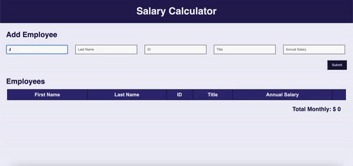

# Jquery Server Calculator

## Description
Created a user interface where the user can input data (First Name, Last Name, ID, Title, Salary) of employees to the table. These data can be added and displayed to a table. Total Monthly cost of all employees data can be calculated and displayed on the screen. 

## Installation
1. Simply download or clone this repository
2. Open up the index.html on browser 

## Screen Shot

### Prerequisites
- NA

## Usage
1. User can enter First Name, Last Name, ID, Title, Salary
2. The table will keep track of these values 
- If user does not input all data, an alert will pop up to prompt the user to complete action 
3. The employee monthly cost will be calculated and added to the table after the 'Submit' button is clicked
4. The Total Monthly cost will be calculated as more employees data are added 
5. If Total Monthly cost exceed over $20,000, it will be highlighted in red 
6. The user will also be able to delete data from the table by clicking the 'Delete' button
7. The Total Monthly cost will also be updated after the 'Delete' button is clicked

## Built With
HTML, JAVASCRIPT, JQUERY, CSS

## Acknowledgement
Thanks to [Prime Digital Academy](www.primeacademy.io) who equipped and helped me to make this application a reality. 

## Support
If you have suggestions or issues, please email me at [nguy2884@umn.edu]
